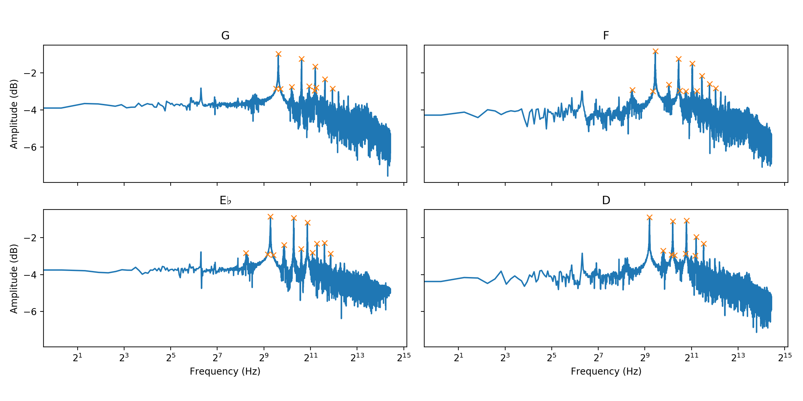
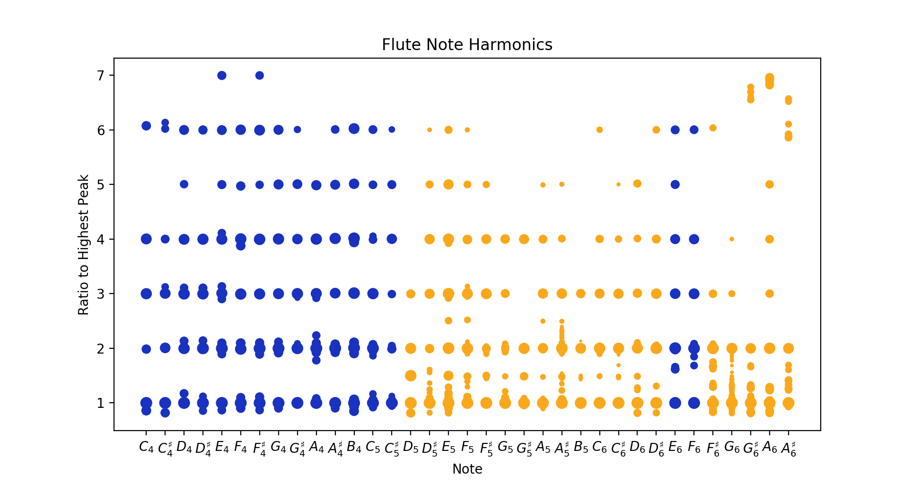
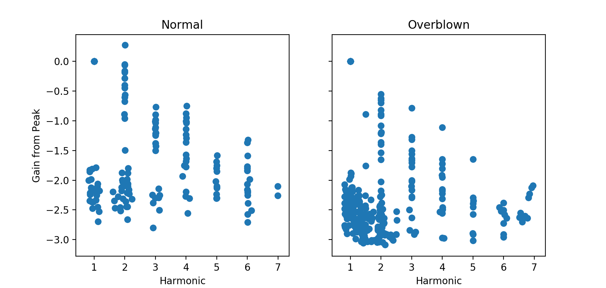
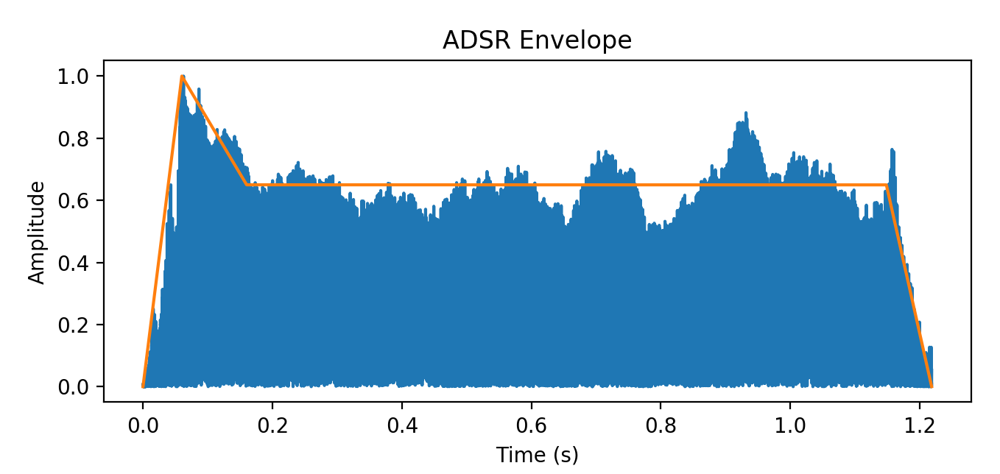
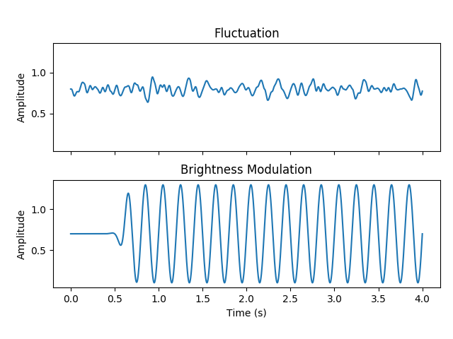
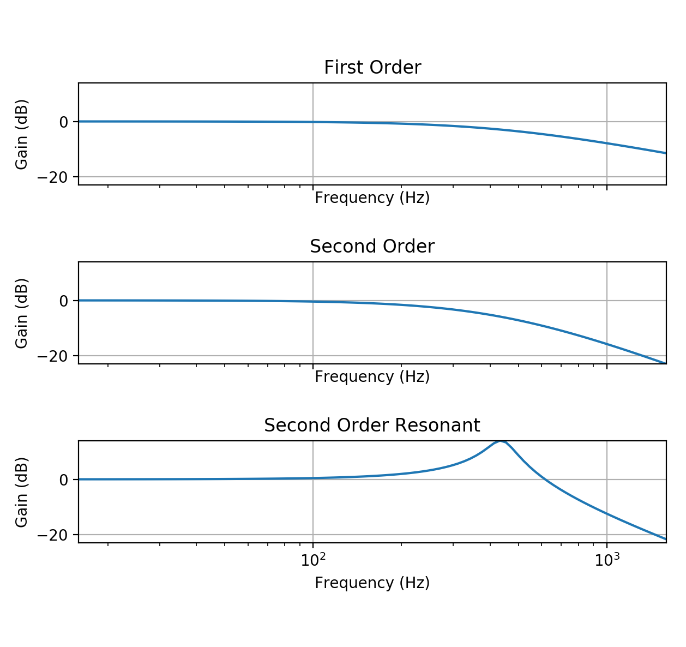
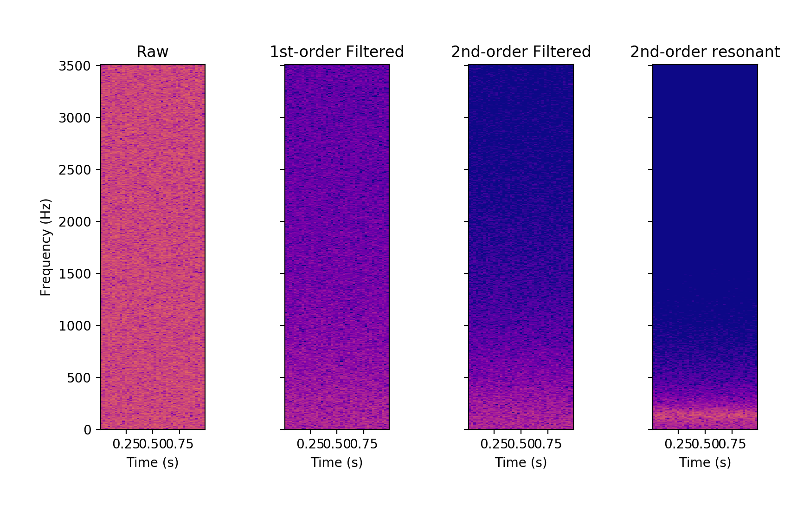
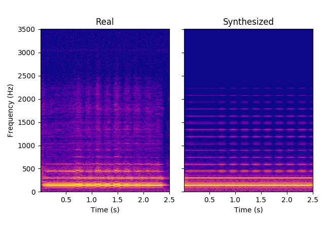

% CS489 Report: Flute Synthesis
% Dave Pagurek (dpagurek, 20551040)
% April 2019
---
geometry: left=3.5cm, right=3.5cm, top=2cm, bottom=2cm
bibliography: bibliography.bibtex
csl: ieee-with-url.csl # From https://github.com/citation-style-language/styles
---

# Motivation

I record music as a hobby, and the music I produce occasionally includes recordings of my own flute playing. I do this because I can get a level of expressivity on the flute that I can't achieve as easily with the synthesizers I work with. I set out to construct a synthesizer that lets me imitate that sound, including the ability to control the intensity, vibrato, breathiness, and other parameters that I make use of when playing a real instrument. I hoped to create a tool that would give me more flexibility when prototyping new pieces, both in terms of the ease with which I can tweak and experiment and also the freedom of not having to disturb roommates should I decide to work at inconvenient times of the day.

My goal was both to produce a flute synthesizer, but also to gain a better understanding of the underlying processes making the flute sound like a flute. So, to begin with, I turned to theory and data to model the harmonics present in the sound of the flute.

# Flute harmonics

## The theory

The flute can be modelled as an open air column [@HyperPhysicsFlute] for the purposes of examining its resonance. Resonant frequencies arise in open air columns due to the standing pressure wave patterns that are able to form. The geometry of the column allows standing waves with integer number of nodes, shown in Figure 1.

{width=60%}

Each standing wave has a wavelength relative to half the length of the instrument [@HyperPhysicsColumn]. The frequency of the note produced by each wave is found by the equation $f = \frac{v}{\lambda}$, where $v$ is the speed of sound, and $\lambda$ is the wavelength. This tells us that the lowest resonant frequency is proportional to twice the length of the instrument. Each successively higher frequency increases by a factor of half the length of the instrument, and every harmonic above that is an integer multiple of this lowest frequency.

Given that the length of a flute is around 66 cm, we can estimate the lowest note, corresponding to one node:

$$\begin{aligned}
f &= \frac{v}{\lambda}\\
&= \frac{340.27 \text{ m/s}}{2 \cdot 66\text{ cm}}
&= 257.78\text{ Hz}\\
\end{aligned}$$

This frequency corresponds to the note $B_3$ and 74 cents. This agrees with the experience of playing the flute, where the lowest note that can be fingered is $C_4$ by covering every hole. If we continue adding doubling the frequency, we start filling in all the possible harmonics. Table 1 shows what notes these correspond to. [^tuning]

\begin{table}[h]
  \centering
  \begin{tabular}{lll}
    {\bf Harmonic} & {\bf Frequency} & {\bf Note} \\
    \hline
    1 & 261.6256 & $C_4$ \\
    2 & 523.2511 & $C_5$ \\
    3 & 784.8767 & $G_5$ and 2 cents \\
    4 & 1046.5023 & $C_6$ \\
    5 & 1308.1278 & $D^\sharp_6$ and 86 cents \\
    6 & 1569.7534 & $G_6$ and 2 cents \\
    7 & 1831.3790 & $A_6$ and 69 cents \\
    8 & 2093.0045 & $C_7$ \\
    9 & 2354.6301 & $D_7$ and 4 cents \\
    10 & 2616.2557 & $D^\sharp_7$ and 86 cents \\
  \end{tabular}
  \caption{Harmonics of $C_4$}
\end{table}

[^tuning]: It is interesting to note here that the harmonic frequencies are not in tune. We perceive a doubling of a frequency to be a jump up an octave, so octaves are found to be proportional to $2^n$ for increasing $n$. Equal-tempered tuning divides the space between octaves into 12 equally spaced semitones, so semitones are proportional to $2^\frac{n}{12}$. Integer multiples of a base note do not always align with these twelfths. Some instruments purposefully detune notes that are intended to be played in a chord with other notes so that the harmonics do not interfere dissonantly with the rest of the chord [@Edouard].)

These are the frequency ratios that will have to be simulated in order to create a convincing flute synthesizer. Higher notes are made by uncovering holes on the flute to effectively shorten its length and increase the frequency of the lowest note that can be sounded.

The next piece of information required is the amplitude of each harmonic. This is what will make a flute sound like a flute. For that, I turn to data from actual recordings.

## Harmonics in the wild

In 2018, I recorded a song [@Pagurek] that featured recordings of myself playing the flute. As a starting point, I extracted four samples from one flute track in the song where a single note is held for around a second. There are samples for the notes G, F, E$\flat$, and D. Each file is a mono wav file at a 44100 Hz, cut down to just be the steady-state portion of the held note. I processed each sample to get a sense of the harmonics present in the sound of the flute.I processed each sample to get a sense of the harmonics present in the sound of the flute.

To do this, I ran each sample through a Fast Fourier Transform (FFT). This converts each sample into the frequency domain, showing, for each frequency contributing to the overall sound, the amplitude of its contribution. The frequency domain is slightly noisy due in part to the background noise in the recording and the imperfections in my own playing, so frequency peaks tend to be spread out over a few frequency bands. I ran the FFT results through a peak finding algorithm to automatically identify, approximately, the peaks in the spectrum. The results are shown in Figure 2.

For each peak found, I graphed its amplitude relative to the ratio of its frequency to the frequency of the note I was playing, shown in Figure 3. We can see that the peaks come in multiples of 0.5. Why does this occur?

All of these frequencies are integer multiples of the fundamental. If the harmonics look like they are all multiples of 0.5, like what we saw in the harmonics from the recordings, the actual fundamental frequency is half of the frequency of the note I was playing. Notes like this are played by overblowing to change the air pressure in the instrument, preventing the first harmonic from sounding.

To figure out which notes this applies to, I played an ascending scale and measured the ratios of the harmonics that sounded to the highest amplitude frequency. The results are shown in  Figure 4. Notes for which harmonics come in multiples of 0.5 instead of 1 indicate overblown notes.

Given this information, I remade the earlier plot of harmonics and their amplitudes using all the scale samples. This time, I made two separate graphs, showing the different falloff for regular and overblown notes, shown in Figure 5.

The large spread of low amplitude values is largely due to noise surrounding the real peak that got picked up by the peak detector. Even in the clear peak regions, there is large variance. I've chosen to average the values into a plausible common amplitude that will sound close enough. The amplitudes I picked for each harmonic in additive synthesis are shown in Table 2.

\begin{table}[h]
  \centering
  \begin{tabular}{lll}
    {\bf Harmonic} & {\bf Normal gain} & {\bf Overblown gain} \\
    \hline
    1 & 0 & 0 \\
    1.5 & -\infty & -1.75 \\
    2 & -0.5 & -1 \\
    2.5 & -\infty & -2.5 \\
    3 & -1.25 & -1.75 \\
    4 & -1.5 & -2 \\
    5 & -2 & -2.5 \\
    6 & -2.25 & -2.6 \\
    7 & -2.3 & -2.7 \\
  \end{tabular}
  \caption{Harmonic amplitudes}
\end{table}

## Note envelope

The next question is how the amplitudes for each frequency change over time. Examining the amplitude for the entire waveform, a standard linear attack-decay-sustain-release function can fit decently. Figure 6 shows an ADSR envelope drawn on top of the waveform of a note played on the flute.

{width=70%}

Do all the harmonics sound at the same time? To answer this question, I looked at short time Fourier transform graph of the same flute recording, shown in Figure 7. This is an overblown note, and the first approximately 0.02 seconds of the recording have a much larger contribution from the fundamental, non-overblown note, before the air rate stabilizes and the note settles on the second harmonic.

{width=70%}

{width=70%}

Figure 7 also demonstrates the fluctuation in amplitude in the harmonics of a held note. Contrast this with intentional vibrato, shown in Figure 8. There are two separate processes going on that shape the amplitude of harmonics: subtle random fluctuation from unconscious air rate changes, and intentional periodic modulation of just the upper harmonics.

I model the former by multiplying the ADSR envelope with Perlin noise [@Perlin]. This generates noise as a continuous function, with each "octave" of noise adding lower-amplitude, higher-frequency detail. Each harmonic oscillator gets its own two-octave noise track, starting at a random offset so that they do not modulate uniformly. The time in seconds is scaled by a factor of 10 before being sent into the noise function so that the amplitude changes quickly enough to be noticeable but not dramatic. I make the noise amplitude range from 0.6 and 1, effectively lowering the amplitude randomly. 

It is interesting that the "vibrato" here is not technically vibrato in the traditional sense. Vibrato is defined as a modulation in pitch, but that is not what we see here. It makes sense that we would not see a change in pitch, since flute vibrato is done entirely with air flow, which does not change the length of the instrument and therefore does not bend the pitch. It also is not traditional tremolo, although this gets close. Tremolo is amplitude modulation, which is what we see, except that it only affects the upper harmonics. Upper harmonic tremolo is perhaps more accurately defined as *brightness* modulation since it primarily affects the timber of the sound.

I model the brightness modulation with a 5Hz sine wave that gets multiplied with the note envelope. It cycles between amplitudes of 0.1 and 1.3, allowing the modulation to nearly completely suppress the harmonic at its low point and slightly boost it at its peak. When playing a note, the vibrato usually does not start immediately, perhaps not starting at all for short notes. To account for this, the sine wave is multiplied with a sigmoid function offset by 0.4s, with time scaled by a factor of 30. This allows the note to remain unmodulated for a moment before the sine wave fades in. This is applied only to harmonics greater than 2. The envelopes for both fluctuation and brightness modulation are shown in Figure 9 to compare their amplitudes and regularity.

{width=70%}

## Noise component

A spectrum analysis of recorded notes shows that there is a noise component to the sound. While this low-energy noise comes from the air flow leaving the mouth, and not the resonance of the instrument itself, it's a distinctive part of the sound of the flute, so it is a sound I want to replicate in the synthesizer.

Looking at the spectrum produced by the recorded noise component in Figure 12, the noise appears to be larger in magnitude in the lower frequencies. This tells us that it is not *white noise*, which is defined to be noise where frequency contributions are the same within the region of interest. One way to generate the sort of noise seen in the recording is to use subtractive synthesis, where one starts with white noise, but then quiets down the higher frequencies by applying a filter.

White noise is defined by having equal contributions from each frequency, but there are multiple functions that generate discrete time-domain samples that create white noise. One could implement *Gaussian white noise*, where samples have a normal distribution with zero mean. However, Gaussian distributions have an unbounded range, and we need amplitudes to stay between -1 and 1. Instead, I used a uniform distribution to generate time-domain samples.

The noise then needs to be filtered down using some kind of lowpass filter, leaving low frequencies the same, but reducing the importance of higher frequencies. A simple first-order system could work, but for frequencies above the bandwidth frequency $\omega_{BW}$, high frequencies roll off at -20dB per decade. In order to have high frequencies roll off faster, higher order systems are required. A second-order system rolls off at -40dB per decade, as shown in Figure 10.

{width=70%}

The steeper rolloff rate more closely matches the recorded data, so I decided to implement a second order low pass filter. Transfer functions for second order systems typically have the form $H(s) = \frac{K\omega_n^2}{s^2 + 2\zeta\omega_n s + \omega_n^2}$. $\omega_n \approx \omega_{BW}$, which is the cutoff frequency after which we see rolloff. No extra gain is needed, so I set the gain to $K = 1$. $\zeta$ dictates the oscillatory behaviour of the system: if it is greater than 1, the system is overdamped, and the filter can overshoot and oscillate when reaching to "catch up" with an input signal. This is undesirable. When $\zeta \le 1$, the system will not oscillate, so I picked $\zeta = 1$ to make the system critically damped, meaning that it will reach its equilibrium point as fast as it can without oscillating.

To actually implement this as a digital filter, the transfer function needs to be turned into a discrete time equation relative to the past discrete samples. The first step is to separate the frequency-domain input $X(s)$ and output $Y(s)$.

$$\begin{aligned}
H(s) &= \frac{K\omega_{BW}^2}{s^2 + 2\zeta\omega_{BW}s + \omega_{BW}^2}\\
\frac{Y(s)}{X(s)} &= \frac{1}{\frac{s^2}{K\omega_{BW}^2} + \frac{2\zeta s}{K\omega_{BW}} + \frac{1}{K}}\\
X(s) &= Y(s)\left(\frac{s^2}{K\omega_{BW}^2} + \frac{2\zeta s}{K\omega_{BW}} + \frac{1}{K}\right)\\
X(s) &= \frac{s^2}{K\omega_{BW}^2}Y(s) + \frac{2\zeta s}{K\omega_{BW}}Y(s) + \frac{1}{K}Y(s)\\
\end{aligned}$$

Having separated input from output, the equation can be brought into the time domain using the inverse Laplace transform, assuming $y(0) = \frac{dy(t)}{dt}\Bigr|_{t=0} = \frac{d^2y(t)}{dt^2}\Bigr|_{t=0} = 0$:

$$\begin{aligned}
\mathcal{L}^{-1}\left\{X(s)\right\} &= \mathcal{L}^{-1}\left\{\frac{s^2}{K\omega_{BW}^2}Y(s) + \frac{2\zeta s}{K\omega_{BW}}Y(s) + \frac{1}{K}Y(s)\right\}\\
x(t) &= \frac{1}{K\omega_{BW}^2}\left(\frac{d^2 y(t)}{dt^2}\right) + \frac{2\zeta}{K\omega_{BW}}\left(\frac{d y(t)}{dt}\right) + \frac{1}{K}y(t)\\
\end{aligned}$$

Finally, the first and second derivatives can be approximated using the discrete time samples $y(t)$, $y(t - \Delta t)$, and $y(t - 2\Delta t)$, rearranging for the next output, $y(t)$:

$$\begin{aligned}
x(t) &= \frac{1}{K\omega_{BW}^2}\left(\frac{y(t) - 2y(t - \Delta t) + y(t - 2\Delta t)}{\Delta t^2}\right) + \frac{2\zeta}{K\omega_{BW}}\left(\frac{y(t) - y(t - \Delta t)}{\Delta t}\right) + \frac{1}{K}y(t)\\
%
y(t) &= \frac{x(t)
  - \left(\frac{-2\zeta}{K\omega_{BW}\Delta t} - \frac{2}{K\omega_{BW}^2\Delta t^2}\right) y(t - \Delta t)
  - \left(\frac{1}{K\omega_{BW}^2\Delta t^2}\right) y(t - 2\Delta t)
}{\frac{1}{K} + \frac{2\zeta}{K\omega_{BW}\Delta t} + \frac{1}{K\omega_{BW}^2\Delta t^2}}\\
%
y(t) &= \left(\frac{K\omega_{BW}^2\Delta t^2}{\omega_{BW}^2\Delta t^2 + 2\zeta\omega_{BW}\Delta t + 1}\right) x(t)\\
  & - \left(\frac{-2\zeta\omega_{BW}\Delta t - 2}{\omega_{BW}^2\Delta t^2 + 2\zeta\omega_{BW}\Delta t + 1}\right) y(t - \Delta t)\\
  & - \left(\frac{1}{\omega_{BW}^2\Delta t^2 + 2\zeta\omega_{BW}\Delta t + 1}\right) y(t - 2\Delta t)\\
\end{aligned}$$

Each new value outputted by the filter is effectively a weighted average of the new input and the past two output values. The concrete values of the weights are found by using $\Delta t = 44100\text{Hz}$, the sampling frequency, and by setting $\omega_{BW}$ to the note being sounded. Figure 11 shows what white noise looks like, subjected to a first-order lowpass filter and this second-order filter.

# Results so far

A short-time Fourier transform graph of a real recording of a $B^\flat_5$ with vibrato is shown next to a graph of the synthesized version of the same thing in Figure 12. It is clear that there are higher harmonics missing in the synthesized version, but where each has increasingly lower frequency and where each becomes more "spread out," fading it into the background noise. Its omission in the synthesized version is noticeable but not too distracting.

# Future work

For the final iteration of this project, I will vary the properties of the synthesizer based on the velocity of a note. I have already recorded some sample data to analyze to provide a basis for these changes. I will then write code to synthesize from MIDI input so that I can compose in a Digital Audio Workstation, get output from the synthesizer, and then use that in the music. I will include a sample track that does this in my final report.

\newpage

# References
