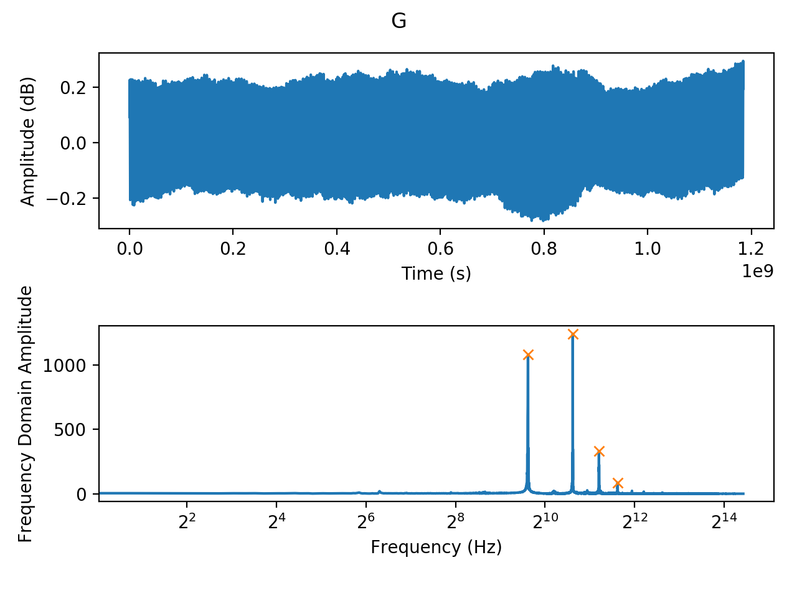
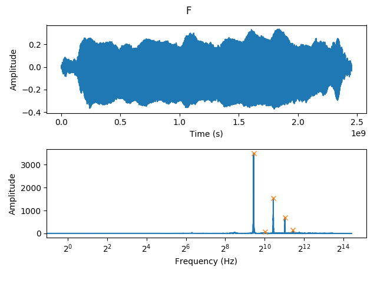
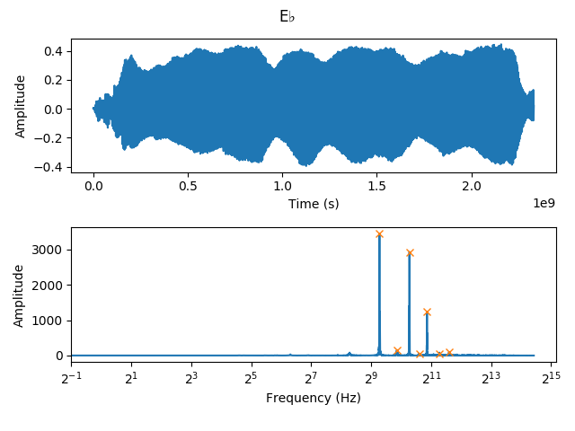
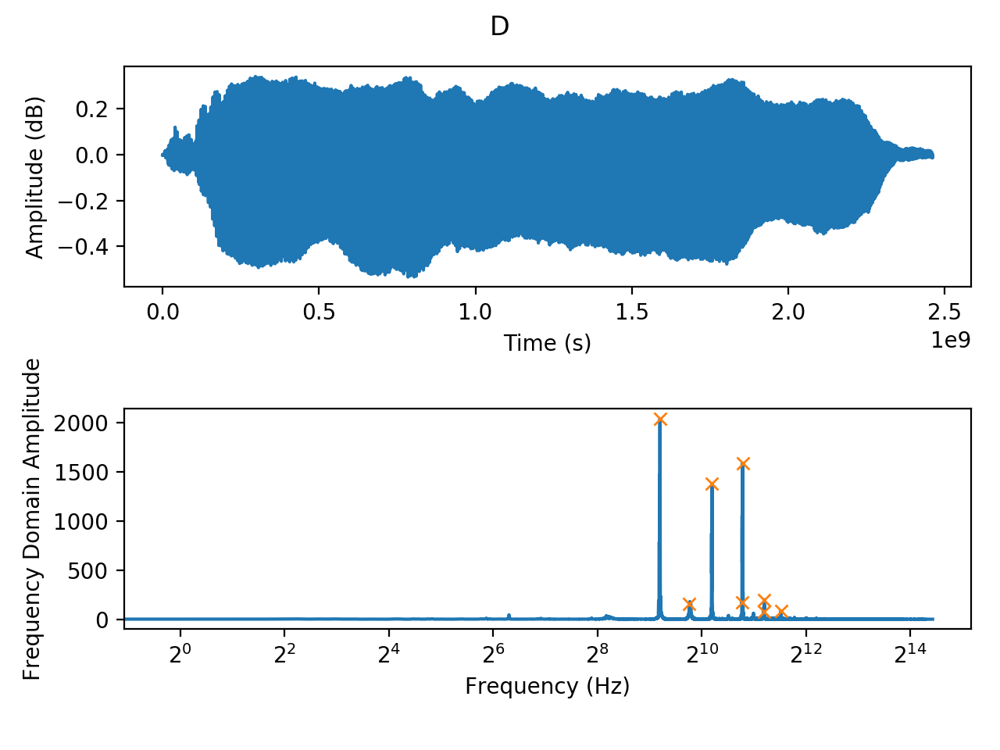
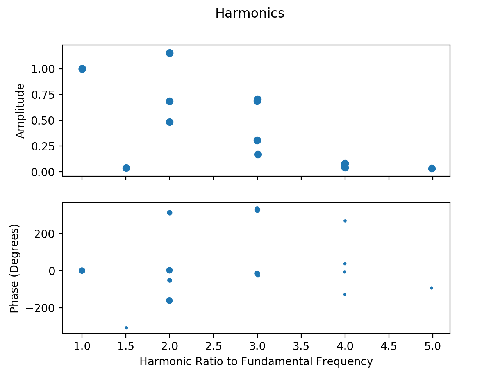

% CS489 Report: Flute Synthesis
% Dave Pagurek (dpagurek, 20551040)
% April 2019
---
geometry: left=3.5cm, right=3.5cm, top=2cm, bottom=2cm
bibliography: bibliography.bibtex
csl: ieee-with-url.csl # From https://github.com/citation-style-language/styles
---

# Introduction

# Background

# Methodology

## Picking oscillators

In 2018, I recorded a song [@Pagurek] that featured recordings of myself playing the flute. I extracted four samples from one flute track in the song where a single note is held for around a second. There are samples for the notes G, F, E$\flat$, and D. I processed each sample to get a sense of the harmonics present in the sound of the flute.

To do this, I ran each sample through a Fast Fourier Transform (FFT). (TODO describe input format.) This converts each sample into the frequency domain, showing, for each frequency contributing to the overall sound, the amplitude of its contribution. The frequency domain is slightly noisy due to the background noise in the recording and the shaky tuning of my own playing, so a peak at a given frequency typically also shows some contribution to the surrounding frequencies. I ran the FFT results through a peak finding algorithm to come up with the frequency and amplitude of each peak, each marked with an X in the figures below.

For each peak found, I graphed its amplitude and phase relative to its distance from the largest peak, which I consider to be the fundamental frequency.

Here we can see that the peaks come in multiples of 0.5. Why does this occur? The flute is an open air column. Resonant frequencies arise in open air columns due to the standing pressure wave patterns that are able to form. The geometry of the column allows standing waves with integer number of nodes:

TODO insert node diagram

Each standing wave has a wavelength relative to the length of the instrument. The frequency of the note produced by each wave is found by the equation $f = \frac{v}{\lambda}$, where $v$ is the speed of sound, and $\lambda$ is the wavelength. This tells us that the lowest resonant frequency is proportional to twice the length of the instrument. Each successively higher frequency increases by a factor of half the length of the instrument.

We define the harmonics of a frequency to be integer multiples of that frequency. Since every frequency resonated by the flute appears to come in intervals of 0.5 instead of 1, this tells us that the true fundamental is actually half of the large initial peak we see in the graphs, and then every successive harmonic frequency is an integer multiple of it.

TODO test if we see integer multiples for e.g. low G

It is interesting to note here that the harmonic frequencies are not in tune. Integer multiples of an in-tune base frequency do not always end up in tune. We perceive two frequencies where one is twice the other to be an octave apart, so octaves are found to be proportional to $2^n$ for increasing $n$. Equal-tempered tuning divides the space between octaves into 12 equally spaced semitones, so semitones are proportional to $2^\frac{n}{12}$. Integer multiples of a base note do not always align with these twelfths. Here is a table of the notes corresponding to the harmonics for an A4 (440 Hz) and the note it sounds:

Harmonic | Frequency | Note
---------|-----------|-----
1 | 440 | A4
2 | 880 | A5
3 | 1320 | E5 and 2 cents
4 | 1760 | A6
5 | 2200 | C6 and 86 cents
6 | 2640 | E6 and 2 cents
7 | 3080 | F#6 and 69 cents
8 | 3520 | A7
9 | 3960 | B7 and 4 cents
10 | 4400 | C7 and 86 cents

## Time variance

# Results

# References
