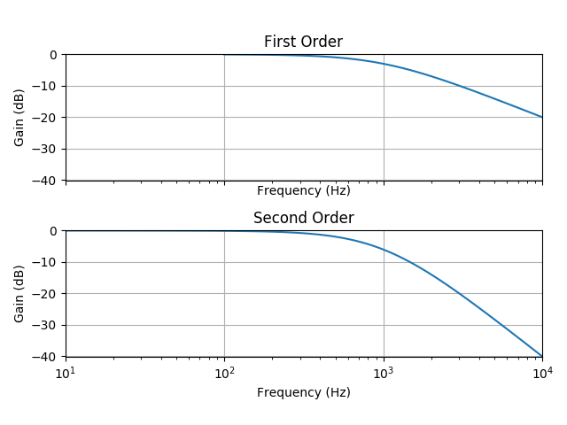
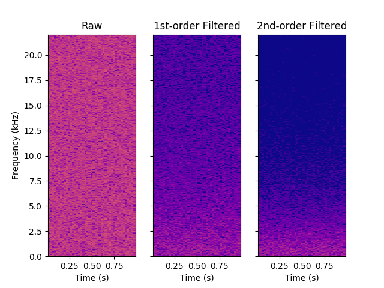

% CS489 Report: Flute Synthesis
% Dave Pagurek (dpagurek, 20551040)
% April 2019
---
geometry: left=3.5cm, right=3.5cm, top=2cm, bottom=2cm
bibliography: bibliography.bibtex
csl: ieee-with-url.csl # From https://github.com/citation-style-language/styles
---

# Introduction

# Background

# Methodology

## Picking oscillators

In 2018, I recorded a song [@Pagurek] that featured recordings of myself playing the flute. I extracted four samples from one flute track in the song where a single note is held for around a second. There are samples for the notes G, F, E$\flat$, and D. I processed each sample to get a sense of the harmonics present in the sound of the flute.

To do this, I ran each sample through a Fast Fourier Transform (FFT). (TODO describe input format.) This converts each sample into the frequency domain, showing, for each frequency contributing to the overall sound, the amplitude of its contribution. The frequency domain is slightly noisy due to the background noise in the recording and the shaky tuning of my own playing, so a peak at a given frequency typically also shows some contribution to the surrounding frequencies. I ran the FFT results through a peak finding algorithm to come up with the frequency and amplitude of each peak, each marked with an X in the figures below.


For each peak found, I graphed its amplitude and phase relative to its distance from the largest peak, which I consider to be the fundamental frequency.


Here we can see that the peaks come in multiples of 0.5. Why does this occur? The flute is an open air column. Resonant frequencies arise in open air columns due to the standing pressure wave patterns that are able to form. The geometry of the column allows standing waves with integer number of nodes:

TODO insert node diagram

Each standing wave has a wavelength relative to the length of the instrument. The frequency of the note produced by each wave is found by the equation $f = \frac{v}{\lambda}$, where $v$ is the speed of sound, and $\lambda$ is the wavelength. This tells us that the lowest resonant frequency is proportional to twice the length of the instrument. Each successively higher frequency increases by a factor of half the length of the instrument.

We define the harmonics of a frequency to be integer multiples of that frequency. Since every frequency resonated by the flute appears to come in intervals of 0.5 instead of 1, this tells us that the true fundamental is actually half of the large initial peak we see in the graphs, and then every successive harmonic frequency is an integer multiple of it.

TODO test if we see integer multiples for e.g. low G

It is interesting to note here that the harmonic frequencies are not in tune. Integer multiples of an in-tune base frequency do not always end up in tune. We perceive two frequencies where one is twice the other to be an octave apart, so octaves are found to be proportional to $2^n$ for increasing $n$. Equal-tempered tuning divides the space between octaves into 12 equally spaced semitones, so semitones are proportional to $2^\frac{n}{12}$. Integer multiples of a base note do not always align with these twelfths. Here is a table of the notes corresponding to the harmonics for an A4 (440 Hz) and the note it sounds:

Harmonic | Frequency | Note
---------|-----------|-----
1 | 440 | A4
2 | 880 | A5
3 | 1320 | E5 and 2 cents
4 | 1760 | A6
5 | 2200 | C6 and 86 cents
6 | 2640 | E6 and 2 cents
7 | 3080 | F#6 and 69 cents
8 | 3520 | A7
9 | 3960 | B7 and 4 cents
10 | 4400 | C7 and 86 cents

## Noise component

A spectrum analysis of recorded notes shows that there is a noise component to the sound. This low-energy noise is the wind sound from blowing into the instrument, picked up in the recording due to the close proximity of the microphone to the instrument. It makes the flute sound more intimate, so it is a sound I want to replicate in the synthesizer.

Looking at the spectrum produced by the recorded noise component, it is clear that frequencies do not all equally contribute to the noise, as the lower frequencies have higher magnitudes. This tells us that it is not *white noise*, which is defined to be noise where frequency contributions are the same within the region of interest. One way to generate the sort of noise seen in the recording is to use subtractive synthesis, where one starts with white noise, but then quiets down the higher frequencies by applying a filter.

White noise is defined by having equal contributions from each frequency, but there are multiple functions that generate discrete samples that create white noise. One could implement *Gaussian white noise*, where samples have a normal distribution with zero mean. However, Gaussian distributions have an unbounded range, but we need amplitudes to stay between -1 and 1. Instead, we can use a uniform distribution:

```python
def noise():
    return np.random.uniform(-1, 1)
```

We then need to filter down this noise using some kind of lowpass filter, that leaves low frequencies the same, but reduces the importance of higher frequencies. A simple first-order system could work, but for frequencies above the bandwidth frequency $\omega_{BW}$, high frequencies roll off at -20dB per decade. In order to have high frequencies roll off faster, higher order systems are required. A second-order system rolls off at -40dB per decade, shown below.



The steeper rolloff rate more closely matches the recorded data, so I decided to implement a second order low pass filter. Transfer functions for second order systems typically have the form $H(s) = \frac{K\omega_n^2}{s^2 + 2\zeta\omega_n s + \omega_n^2}$. $\omega_n \approx \omega_{BW}$, which is the cutoff frequency after which we see rolloff. We do not need any extra gain, so set the gain $K = 1$. $\zeta$ dictates the oscillatory behaviour of the system: if it is greater than 1, the system is overdamped, and the filter can overshoot and oscillate when reaching to "catch up" with an input signal. We do not want this to happen, and when $\zeta \le 1$, the system will not oscillate. We will pick $\zeta = 1$ so that the system is critically damped and will reach its equilibrium point as fast as it can without oscillating.

To actually implement this as a digital filter, we need to turn the transfer function into a discrete time equation relative to the past discrete samples.

$$\begin{aligned}
H(s) &= \frac{\omega_{BW}}{s^2 + 2\omega_{BW}s + \omega_{BW}^2}\\
\frac{Y(s)}{X(s)} &= \frac{1}{\frac{s^2}{\omega_{BW}^2} + \frac{2s}{\omega_{BW}} + 1}\\
X(s) &= Y(s)\left(\frac{s^2}{\omega_{BW}^2} + \frac{2s}{\omega_{BW}} + 1\right)\\
X(s) &= \frac{s^2}{\omega_{BW}^2}Y(s) + \frac{2s}{\omega_{BW}}Y(s) + Y(s)\\
\end{aligned}$$

Having separated input from output, we can bring the equation into the time domain using the inverse Laplace transform, assuming $y(0) = \frac{dy(t)}{dt}\Bigr|_{t=0} = \frac{d^2y(t)}{dt^2}\Bigr|_{t=0} = 0$:

$$\begin{aligned}
\mathcal{L}^{-1}\left\{U(s)\right\} &= \mathcal{L}^{-1}\left\{\frac{s^2}{\omega_{BW}^2}Y(s) + \frac{2s}{\omega_{BW}}Y(s) + Y(s)\right\}\\
x(t) &= \frac{1}{\omega_{BW}^2}\left(\frac{d^2 y(t)}{dt^2}\right) + \frac{2}{\omega_{BW}}\left(\frac{d y(t)}{dt}\right) + y(t)\\
\end{aligned}$$

We can then bring everything into discrete time by approximating first and second derivatives and rearranging for $y(t)$:

$$\begin{aligned}
x(t) &= \frac{1}{\omega_{BW}^2}\left(\frac{y(t) - 2y(t - \Delta t) + y(t - 2\Delta t)}{\Delta t^2}\right) + \frac{2}{\omega_{BW}}\left(\frac{y(t) - y(t - \Delta t)}{\Delta t}\right) + y(t)\\
%
y(t) &= \frac{x(t)
  - \left(\frac{-2}{\omega_{BW}\Delta t} - \frac{2}{\omega_{BW}^2\Delta t^2}\right) y(t - \Delta t)
  - \left(\frac{1}{\omega_{BW}^2\Delta t^2}\right) y(t - 2\Delta t)
}{1 + \frac{2}{\omega_{BW}\Delta t} + \frac{1}{\omega_{BW}^2\Delta t^2}}\\
%
y(t) &= \left(\frac{\omega_{BW}^2\Delta t^2}{\omega_{BW}^2\Delta t^2 + 2\omega_{BW}\Delta t + 1}\right) x(t)\\
  & - \left(\frac{-2\omega_{BW}\Delta t - 2}{\omega_{BW}^2\Delta t^2 + 2\omega_{BW}\Delta t + 1}\right) y(t - \Delta t)\\
  & - \left(\frac{1}{\omega_{BW}^2\Delta t^2 + 2\omega_{BW}\Delta t + 1}\right) y(t - 2\Delta t)\\
\end{aligned}$$

If we let $\alpha = \frac{\omega_{BW} \Delta t}{\omega_{BW} \Delta t + 1}$, then we can see that each new value is effectively a weighted average of the new input and the past two output values:

$$\begin{aligned}
y(t) &= \alpha^2 x(t)\\
  & - 2(\alpha - 1) y(t - \Delta t)\\
  & - (1 - \alpha)^2 y(t - 2\Delta t)\\
\end{aligned}$$

We can then find the value of $\alpha$ using $\Delta t = 44100\text{Hz}$, the sampling frequency, and $\omega_{BW} = 15000\text{Hz}$, the approximate frequency around which we want to start seeing rolloff. Here is what white noise looks like, subjected to a first-order lowpass filter and this second-order filter:




## Time variance

# Results

# References
